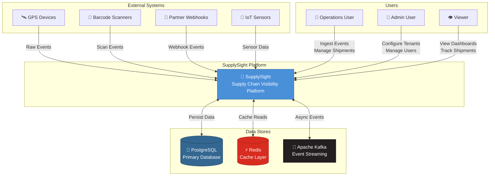
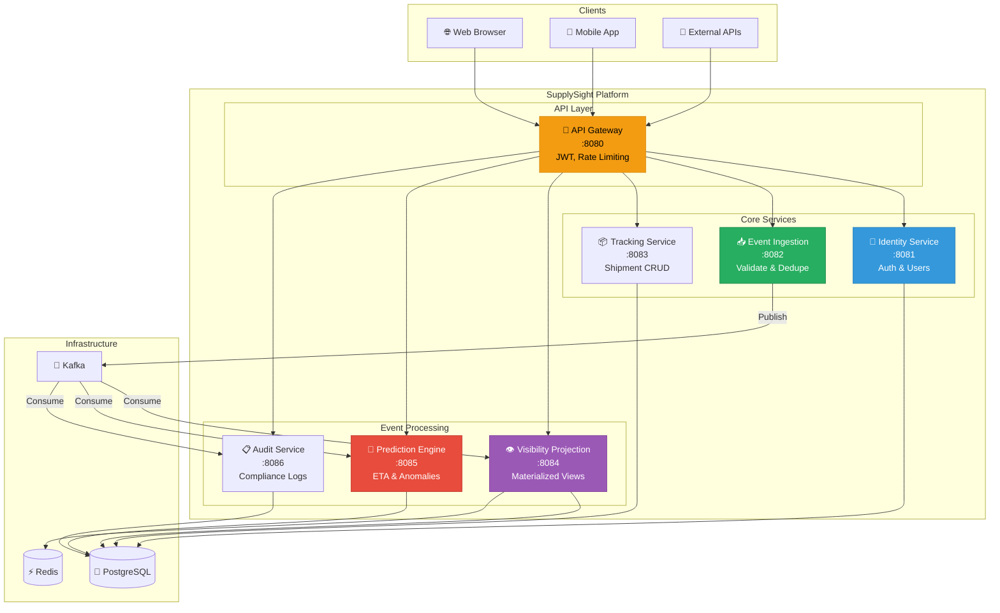
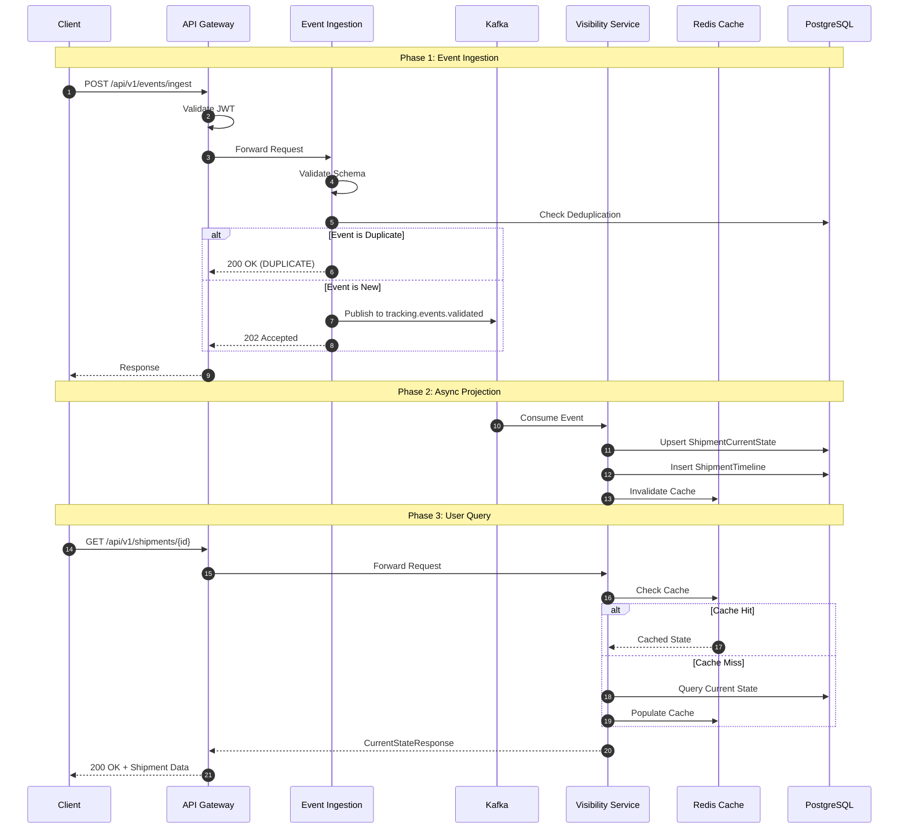
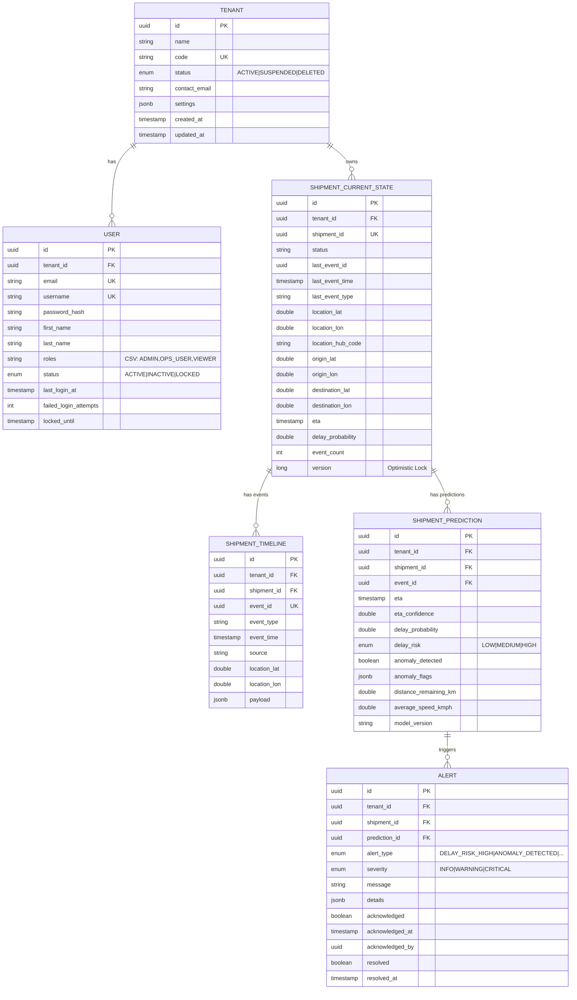

# SupplySight - System Design Document

> **Principal Architect's Design Reference**  
> Comprehensive technical documentation for the Supply Chain Visibility Platform

---

## Part 1: The "Grandmother" Summary 👵

### The Analogy

> **Think of SupplySight as a 24/7 Control Tower at a major airport**, but for packages instead of airplanes.
>
> Just like air traffic controllers monitor every plane's position, speed, and expected arrival time—alerting staff instantly if a flight is delayed or veering off course—SupplySight does the same for shipments moving across the supply chain.
>
> External "radar signals" (GPS devices, barcode scanners, IoT sensors) constantly report where each package is. The Control Tower (our platform) processes these signals, maintains a live map of every shipment, predicts when packages will arrive, and raises alarms if something goes wrong.

### The Business Value

**SupplySight enables logistics companies to see where every shipment is right now, predict when it will arrive, and get instant alerts when problems occur—reducing delivery failures, improving customer satisfaction, and cutting operational costs.**

---

## Part 2: Visual Architecture (C4 Model)

### Level 1: System Context Diagram

The high-level view showing SupplySight's relationship with external systems.



---

### Level 2: Container Diagram

Zooming into the SupplySight platform to show internal services.



---

### Level 3: Sequence Diagram (Happy Path)

The critical flow: **Event Ingestion → Visibility Update → User Query**



---

## Part 3: Data & Interface Design

### Database Schema (ERD)

Entity Relationship Diagram based on JPA `@Entity` classes.



---

### API Contract Summary

<details>
<summary><b>📥 Top 3 API Endpoints</b></summary>

#### 1. Event Ingestion
| Attribute | Value |
|-----------|-------|
| **Endpoint** | `POST /api/v1/events/ingest` |
| **Service** | Event Ingestion (8082) |
| **Auth** | JWT with `ADMIN` or `OPS_USER` role |

**Request DTO:**
```json
{
  "eventId": "UUID (required, idempotency key)",
  "tenantId": "UUID (required)",
  "shipmentId": "UUID (required)",
  "eventType": "CREATED|IN_TRANSIT|DELIVERED|...",
  "eventTime": "ISO-8601 timestamp",
  "source": "GPS_DEVICE|SCANNER|WEBHOOK",
  "location": { "lat": 12.97, "lon": 77.59, "hubCode": "BLR-01" },
  "payload": { "speedKmph": 62 }
}
```

**Response DTO:**
```json
{
  "eventId": "UUID",
  "status": "ACCEPTED|DUPLICATE|REJECTED",
  "message": "Event accepted for processing"
}
```

---

#### 2. Get Shipment Current State
| Attribute | Value |
|-----------|-------|
| **Endpoint** | `GET /api/v1/shipments/{shipmentId}` |
| **Service** | Visibility Projection (8084) |
| **Auth** | JWT (any authenticated user) |

**Response DTO:**
```json
{
  "shipmentId": "UUID",
  "tenantId": "UUID",
  "status": "IN_TRANSIT",
  "lastEventTime": "2026-01-23T10:20:30Z",
  "lastLocation": { "lat": 12.97, "lon": 77.59, "hubCode": "BLR-01" },
  "eta": "2026-01-25T14:30:00Z",
  "delayProbability": 0.15,
  "eventCount": 5,
  "updatedAt": "2026-01-23T10:20:35Z"
}
```

---

#### 3. Get Latest Prediction
| Attribute | Value |
|-----------|-------|
| **Endpoint** | `GET /api/v1/predictions/{shipmentId}` |
| **Service** | Prediction Engine (8085) |
| **Auth** | JWT (any authenticated user) |

**Response DTO:**
```json
{
  "shipmentId": "UUID",
  "eta": "2026-01-25T14:30:00Z",
  "etaConfidence": 0.85,
  "delayProbability": 0.15,
  "delayRisk": "LOW|MEDIUM|HIGH",
  "anomalyDetected": false,
  "anomalyFlags": [],
  "distanceRemainingKm": 450.5,
  "averageSpeedKmph": 55.2,
  "modelVersion": "heuristic-v1"
}
```

</details>

---

## Part 4: Architectural Decision Records (ADRs)

### ADR-001: Event-Driven Architecture with Kafka

| Aspect | Decision |
|--------|----------|
| **Context** | High-throughput event ingestion (target: 10K events/sec) with reliable processing |
| **Decision** | Use Apache Kafka as the central message broker |
| **Rationale** | • Decouples producers (ingestion) from consumers (visibility, predictions, audit)<br>• Enables replay of events for debugging or rebuilding projections<br>• Built-in partitioning for parallel processing<br>• At-least-once semantics with idempotent consumers |
| **Consequences** | • Requires Zookeeper/KRaft cluster management<br>• Added operational complexity<br>• Eventual consistency between write and read |

---

### ADR-002: CQRS with Materialized Views

| Aspect | Decision |
|--------|----------|
| **Context** | Need sub-300ms query latency while handling high write throughput |
| **Decision** | Separate command (write) and query (read) paths using materialized views |
| **Rationale** | • `ShipmentCurrentState` is a denormalized projection optimized for reads<br>• `ShipmentTimeline` is append-only for audit trail<br>• Redis caching layer for hot data |
| **Consequences** | • Data eventually consistent (typically <100ms lag)<br>• Requires careful handling of out-of-order events (solved via `eventTime` ordering) |

---

### ADR-003: Multi-Tenancy via Row-Level Security

| Aspect | Decision |
|--------|----------|
| **Context** | SaaS platform serving multiple organizations with data isolation |
| **Decision** | Shared database with `tenant_id` column + application-level filtering |
| **Rationale** | • Cost-effective (shared infrastructure)<br>• `TenantContext` ThreadLocal ensures every query includes tenant filter<br>• JWT claims embed `tenantId` for validation |
| **Consequences** | • Risk of data leakage if tenant filter missed (mitigated by code review + tests)<br>• Cannot use RLS at database level without PostgreSQL Enterprise |

---

### ADR-004: Optimistic Locking for Concurrent Updates

| Aspect | Decision |
|--------|----------|
| **Context** | Multiple Kafka consumers may update the same `ShipmentCurrentState` |
| **Decision** | Use JPA `@Version` annotation for optimistic locking |
| **Rationale** | • Visible in `ShipmentCurrentState.version` field<br>• Hibernate throws `OptimisticLockException` on concurrent modification<br>• Retry logic in consumer handles conflicts |
| **Consequences** | • May need retry logic under high concurrency<br>• Better than pessimistic locking for read-heavy workloads |

---

### ADR-005: Heuristic-Based Prediction Model

| Aspect | Decision |
|--------|----------|
| **Context** | Need ETA predictions and anomaly detection |
| **Decision** | Start with rule-based heuristics (`modelVersion: heuristic-v1`) |
| **Rationale** | • Explainable results (vs black-box ML)<br>• Fast to implement and iterate<br>• `modelVersion` field enables future ML model A/B testing<br>• Factors stored in JSONB for model evolution |
| **Consequences** | • Lower accuracy than ML models<br>• Allows incremental ML adoption |

---

### ADR-006: BCrypt for Password Hashing

| Aspect | Decision |
|--------|----------|
| **Context** | Secure storage of user passwords |
| **Decision** | Use BCrypt with default strength (10 rounds) |
| **Rationale** | • Industry standard, widely audited<br>• Built-in salt generation<br>• Adaptive work factor (can increase rounds over time) |
| **Consequences** | • ~100ms per hash operation (by design, resistant to brute force) |

---

## Part 5: Operational Excellence

### Observability

#### Metrics (Micrometer/Prometheus)

All services expose metrics at `/actuator/prometheus`. Key custom metrics:

| Metric Name | Type | Description |
|-------------|------|-------------|
| `kafka.validated.events.received` | Counter | Events received from Kafka |
| `kafka.validated.events.processed` | Counter | Successfully projected events |
| `kafka.validated.events.failed` | Counter | Events that failed processing |
| `shipments.active` | Gauge | Currently active shipments |
| `api.request.duration` | Timer | API response time distribution |
| `api.request.total` | Counter | Total API requests |

**Example Prometheus Query:**
```promql
# Event processing rate
rate(kafka_validated_events_processed_total[5m])

# API p99 latency
histogram_quantile(0.99, rate(api_request_duration_seconds_bucket[5m]))
```

---

#### Health Checks

| Endpoint | Purpose |
|----------|---------|
| `/actuator/health/liveness` | Container alive check (Kubernetes) |
| `/actuator/health/readiness` | Ready to accept traffic |
| `/actuator/health` | Full health with dependencies |

---

#### Logging

- **Structured JSON logging** in production
- **Correlation ID propagation** via MDC (`correlationId`, `tenantId`)
- Correlation IDs flow through:
  - API Gateway → HTTP headers (`X-Correlation-ID`)
  - Kafka message headers
  - Log context

---

### Failure Modes & Resilience

#### Database Unavailable

| Scenario | Behavior |
|----------|----------|
| **Read Operations** | Redis cache serves stale data (cache-aside pattern) |
| **Write Operations** | Request fails with 503; retry with exponential backoff |
| **Health Check** | `/actuator/health` reports `DOWN`; load balancer removes instance |

**Current Implementation:** The system uses HikariCP connection pooling with health checks but does not currently implement a circuit breaker pattern (no Resilience4j detected).

---

#### Kafka Unavailable

| Scenario | Behavior |
|----------|----------|
| **Event Ingestion** | Producer buffers messages locally (configurable buffer size) |
| **Consumers** | Pause consumption; resume when Kafka recovers |
| **Data Loss Risk** | At-least-once delivery with manual acknowledgment minimizes loss |

**Mitigation Strategies:**
- Kafka configured for replication (3 brokers recommended for production)
- Consumer uses manual `acknowledgment.acknowledge()` after successful processing
- Failed events are logged (DLQ implementation recommended for production)

---

#### Redis Unavailable

| Scenario | Behavior |
|----------|----------|
| **Cache Miss** | Falls back to PostgreSQL |
| **Performance** | Increased latency (50ms → 200ms) |
| **Availability** | System remains functional |

---

### Performance Targets

| Metric | Target | Current Design |
|--------|--------|----------------|
| API Response Time (p99) | <300ms | Redis caching, read replicas |
| Event Ingestion Throughput | 10K events/sec | Kafka partitioning, batch processing |
| Query Latency (cached) | <50ms | Redis cache-aside |
| Query Latency (uncached) | <200ms | Optimized indexes, connection pooling |

---

## Appendix: Service Ports

| Service | Port | Purpose |
|---------|------|---------|
| API Gateway | 8080 | Central entry point |
| Identity Service | 8081 | Auth & user management |
| Event Ingestion | 8082 | Event validation |
| Tracking Service | 8083 | Shipment CRUD |
| Visibility Projection | 8084 | Real-time visibility |
| Prediction Engine | 8085 | ETA predictions |
| Audit Service | 8086 | Audit logging |

---

## Appendix: Kafka Topics

| Topic | Producers | Consumers | Purpose |
|-------|-----------|-----------|---------|
| `tracking.events.raw` | External systems | Event Ingestion | Raw unvalidated events |
| `tracking.events.validated` | Event Ingestion | Visibility, Prediction, Audit | Validated events |
| `tracking.predictions` | Prediction Engine | Audit | Prediction results |
| `tracking.alerts` | Prediction Engine | Notification services | High-priority alerts |
| `tracking.audit` | All services | Audit Service | Audit events |

---

*Document generated: February 2026*  
*Architecture Version: 1.0.0-SNAPSHOT*
